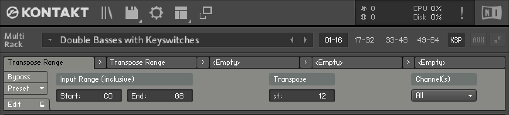
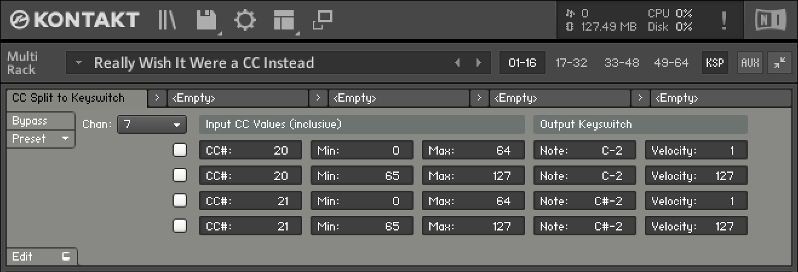

# kontakt-tools

Useful Kontakt scripts for building virtual orchestra templates. These are multiscripts, which work
even with locked Kontakt libraries.

## Transpose Range

Keyswitch-friendly transposition, applied to all channels in a Multi or to just a specific channel.
This lets you transpose the “real notes” of an instrument without affecting the keyswitches.

🔗 **GET IT HERE**: [Transpose Range](transpose-range/README.md)

## CC Split to Keyswitch

Turn input MIDI CC messages from your controller hardware and DAW into keyswitch notes, optionally
with split behavior depending on the value. This lets you control velocity-sensitive keyswitches,
for example.

🔗 **GET IT HERE**: [CC Split to Keyswitch](cc-split-to-keyswitch/README.md)

## License

These scripts are all free to use, modify, and share, released under the [MIT License](LICENSE).
