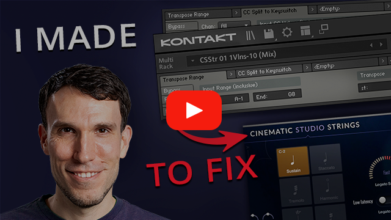
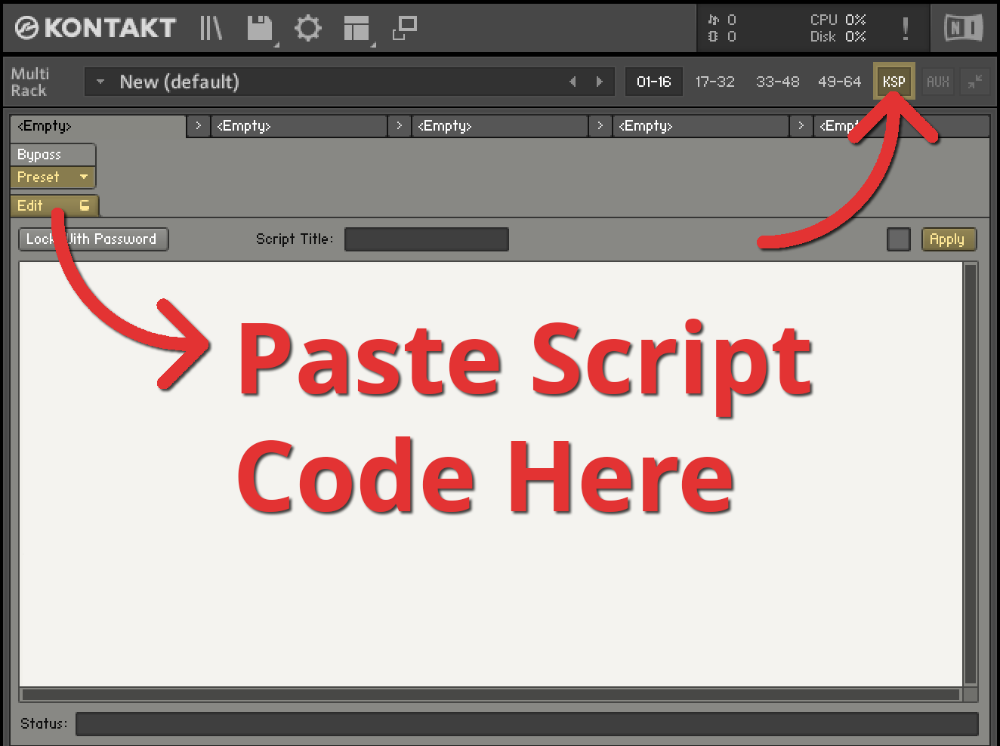
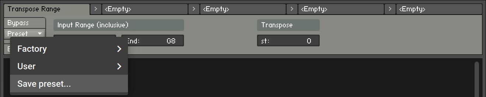
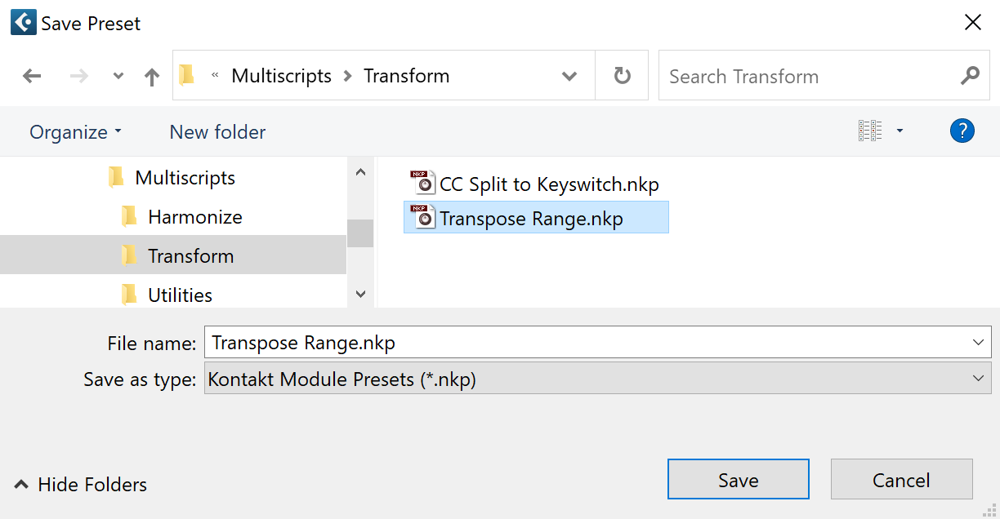

# Transpose Range

Keyswitch-friendly transposition, applied to all channels in a Multi or to just a specific channel.
This lets you transpose the “real notes” of an instrument without affecting the keyswitches.


Video demo &amp; setup walkthrough:

[](https://youtu.be/V8jjvALg1Q4)

## Setup Instructions

1. Go to [The Code](#the-code) toward the bottom of this page, and click on the copy button that
   appears in the upper right corner to copy the script code to your clipboard.

2. Open Kontakt (or Kontakt Player) and click the **KSP** button toward the top to open the
   Multi Script editor.

3. Click the **Edit** button in the lower left corner of the editor, which will open a big text
   area. Then paste the script code you copied in step 1 into that text area with **Ctrl V** or
   **⌘ V**.

   

4. Click the **Apply** button. Then click **Edit** again to collapse the code view.

5. Now click the **Preset** menu and select **Save preset...**, which should open up a file save
   dialog that is opened to a `Multiscripts` subfolder of your Kontakt user presets. Double click
   on the `Transform` subfolder (since that's the type of script this is), then save this script
   as `Transpose Range.nkp`.

   
   

6. Note that if you have multiple versions of Kontakt (*e.g.* Kontakt 6 and Kontakt 7), you will
   have to repeat these steps for each version, since these presets are not shared automatically.

## Usage Instructions

After saving the above script code as a preset, you can load it in any Kontakt Multi by opening the
**KSP** Multi Script editor and selecting **Preset > User > Transform > Transpose Range**.

1. Set the **Start** and **End** notes of the Input Range so that they include the “real notes” you
   want to transpose (but not any keyswitches you want to leave unaffected).

   Reminder that pitch notation within Kontakt uses the C3 is middle C (MIDI note 60) convention.

2. Set **Transpose** to the appropriate number of semitones (*st*) up or down. For example,
   transposition by `-12` will cause an incoming middle C (MIDI note 60, “C3” for Kontakt) from your
   DAW or MIDI controller hardware to play an octave lower (MIDI note 48, “C2” for Kontakt) within
   the Kontakt instrument(s) you are controlling.

3. If you want this transposition to apply to all Kontakt Instruments in this Multi, leave
   **Channel(s)** set to its default of `All`. If you want the transposition to apply only to a
   specific MIDI channel, choose it. If you need transposition applied to some but not all MIDI
   channels, then you can use multiple instances of this Transpose Range script.

## The Code

After copying, go [back to the Setup Instructions](#setup-instructions).

```text
{***********************************************************
Transpose Range
https://github.com/barndollarmusic/kontakt-tools

Author: Eric Barndollar
Modified: 2024-06-18
License: MIT

Based on Factory Remap Keyboard and MIDI Transpose Scripts.
************************************************************}

on init
 message("")
 set_script_title("Transpose Range")
 set_ui_height(1)

 declare ui_label $in_range_label (2, 1)
 set_text($in_range_label, "Input Range (inclusive)")
 set_control_par(get_ui_id($in_range_label), $CONTROL_PAR_GRID_X, 1)
 set_control_par(get_ui_id($in_range_label), $CONTROL_PAR_GRID_Y, 1)

 declare ui_value_edit $in_range_start (0, 127, $VALUE_EDIT_MODE_NOTE_NAMES)
 set_control_par(get_ui_id($in_range_start), $CONTROL_PAR_VALUE, 0)
 set_control_par(get_ui_id($in_range_start), $CONTROL_PAR_GRID_X, 1)
 set_control_par(get_ui_id($in_range_start), $CONTROL_PAR_GRID_Y, 2)
 set_control_par_str(get_ui_id($in_range_start), $CONTROL_PAR_TEXT, "Start")
 make_persistent($in_range_start)
 read_persistent_var($in_range_start)

 declare ui_value_edit $in_range_end (0, 127, $VALUE_EDIT_MODE_NOTE_NAMES)
 set_control_par(get_ui_id($in_range_end), $CONTROL_PAR_VALUE, 127)
 set_control_par(get_ui_id($in_range_end), $CONTROL_PAR_GRID_X, 2)
 set_control_par(get_ui_id($in_range_end), $CONTROL_PAR_GRID_Y, 2)
 set_control_par_str(get_ui_id($in_range_end), $CONTROL_PAR_TEXT, "End")
 make_persistent($in_range_end)
 read_persistent_var($in_range_end)

 declare ui_label $semitones_label (1, 1)
 set_text($semitones_label, "Transpose")
 set_control_par(get_ui_id($semitones_label), $CONTROL_PAR_GRID_X, 4)
 set_control_par(get_ui_id($semitones_label), $CONTROL_PAR_GRID_Y, 1)

 declare ui_value_edit $transpose_semitones (-48, 48, 1)
 set_control_par(get_ui_id($transpose_semitones), $CONTROL_PAR_VALUE, 0)
 set_control_par(get_ui_id($transpose_semitones), $CONTROL_PAR_GRID_X, 4)
 set_control_par(get_ui_id($transpose_semitones), $CONTROL_PAR_GRID_Y, 2)
 set_control_par_str(get_ui_id($transpose_semitones), $CONTROL_PAR_TEXT, "st")
 make_persistent($transpose_semitones)
 read_persistent_var($transpose_semitones)

 declare ui_label $channels_label (1, 1)
 set_text($channels_label, "Channel(s)")
 set_control_par(get_ui_id($channels_label), $CONTROL_PAR_GRID_X, 6)
 set_control_par(get_ui_id($channels_label), $CONTROL_PAR_GRID_Y, 1)

 declare ui_menu $channels_menu
 add_menu_item($channels_menu, "All", 0)
 add_menu_item($channels_menu, "1", 1)
 add_menu_item($channels_menu, "2", 2)
 add_menu_item($channels_menu, "3", 3)
 add_menu_item($channels_menu, "4", 4)
 add_menu_item($channels_menu, "5", 5)
 add_menu_item($channels_menu, "6", 6)
 add_menu_item($channels_menu, "7", 7)
 add_menu_item($channels_menu, "8", 8)
 add_menu_item($channels_menu, "9", 9)
 add_menu_item($channels_menu, "10", 10)
 add_menu_item($channels_menu, "11", 11)
 add_menu_item($channels_menu, "12", 12)
 add_menu_item($channels_menu, "13", 13)
 add_menu_item($channels_menu, "14", 14)
 add_menu_item($channels_menu, "15", 15)
 add_menu_item($channels_menu, "16", 16)
 set_control_par(get_ui_id($channels_menu), $CONTROL_PAR_GRID_X, 6)
 set_control_par(get_ui_id($channels_menu), $CONTROL_PAR_GRID_Y, 2)
 make_persistent($channels_menu)
 read_persistent_var($channels_menu)

 declare $new_key
 declare $affected_chan_idx
end on

on midi_in
 {* Only process notes... *}
 if ($MIDI_COMMAND # $MIDI_COMMAND_NOTE_ON and $MIDI_COMMAND # $MIDI_COMMAND_NOTE_OFF and $MIDI_COMMAND # $MIDI_COMMAND_POLY_AT)
  exit
 end if

 {* ...on the configured channel(s)... *}
 $affected_chan_idx := get_control_par(get_ui_id($channels_menu), $CONTROL_PAR_SELECTED_ITEM_IDX) - 1
 if (($affected_chan_idx # -1) and ($MIDI_CHANNEL # $affected_chan_idx))
  exit
 end if

 {* ...in the configured range. *}
 if (not in_range($MIDI_BYTE_1, $in_range_start, $in_range_end))
  exit
 end if

 $new_key := $MIDI_BYTE_1 + $transpose_semitones

 if (not in_range($new_key, 0, 127))
  {* Transposed note is out of valid MIDI range, ignore it. *}
  ignore_midi
 else
  {* Transposed note is in valid MIDI range, change it. *}
  set_event_par($EVENT_ID, $EVENT_PAR_MIDI_BYTE_1, $new_key)
 end if
end on
```

## Version History

Any bug fixes or feature additions will be listed here. See if your saved preset is the latest
version by clicking the **Edit** buton and looking at the `Modified:` date (*YYYY-MM-DD*) within
your script code.

| Date       | Changes |
| ---------- | ------------- |
| 2024-06-18 | Added missing Channel(s) menu (sorry! just realized I had uploaded an older version). |
| 2023-07-11 | Initial version. (This was missing Channels control). |
