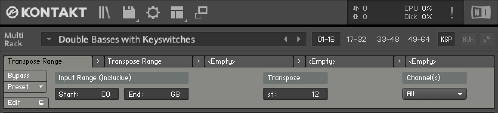

# Transpose Range

Keyswitch-friendly transposition, applied to all channels in a Multi or to just a specific channel.
This lets you transpose the “real notes” of an instrument without affecting the keyswitches.



<!-- TODO: Add link to YouTube video showing it. -->

## Setup Instructions

1. In the code block below this list, click on the copy button that appears in the upper right
   corner to copy the script code to your clipboard.

2. Open Kontakt (or Kontakt Player) and click the **KSP** button toward the top to open the
   Multi Script editor.

3. Click the **Edit** button in the lower left corner of the editor, which will open a big text
   area. Then paste the script code you copied in step 1 into that text area with **Ctrl V** or
   **⌘ V**.

   

4. Click the **Apply** button. Then click **Edit** again to collapse the code view.

5. Now click the **Preset** menu and select **Save preset...**, which should open up a file save
   dialog that is opened to a `Multiscripts` subfolder of your Kontakt user presets. Double click
   on the `Transform` subfolder (since that's the type of script this is), then save this script
   as `Transpose Range.nkp`.

   
   

6. Note that if you have multiple versions of Kontakt (*e.g.* Kontakt 6 and Kontakt 7), you will
   have to repeat these steps for each version, since these presets are not shared automatically.

```text
{***********************************************************
Transpose Range
https://github.com/barndollarmusic/kontakt-tools

Author: Eric Barndollar
Modified: 2023-07-07
License: MIT

Based on Factory Remap Keyboard and MIDI Transpose Scripts.
************************************************************}

on init
	message("")
	set_script_title("Transpose Range")
	set_ui_height(1)

	declare ui_label $in_range_label (2, 1)
	set_text($in_range_label, "Input Range (inclusive)")
	set_control_par(get_ui_id($in_range_label), $CONTROL_PAR_GRID_X, 1)
	set_control_par(get_ui_id($in_range_label), $CONTROL_PAR_GRID_Y, 1)

	declare ui_value_edit $in_range_start (0, 127, $VALUE_EDIT_MODE_NOTE_NAMES)
	set_control_par(get_ui_id($in_range_start), $CONTROL_PAR_VALUE, 0)
	set_control_par(get_ui_id($in_range_start), $CONTROL_PAR_GRID_X, 1)
	set_control_par(get_ui_id($in_range_start), $CONTROL_PAR_GRID_Y, 2)
	set_control_par_str(get_ui_id($in_range_start), $CONTROL_PAR_TEXT, "Start")
	make_persistent($in_range_start)
	read_persistent_var($in_range_start)

	declare ui_value_edit $in_range_end (0, 127, $VALUE_EDIT_MODE_NOTE_NAMES)
	set_control_par(get_ui_id($in_range_end), $CONTROL_PAR_VALUE, 127)
	set_control_par(get_ui_id($in_range_end), $CONTROL_PAR_GRID_X, 2)
	set_control_par(get_ui_id($in_range_end), $CONTROL_PAR_GRID_Y, 2)
	set_control_par_str(get_ui_id($in_range_end), $CONTROL_PAR_TEXT, "End")
	make_persistent($in_range_end)
	read_persistent_var($in_range_end)

	declare ui_label $semitones_label (1, 1)
	set_text($semitones_label, "Transpose")
	set_control_par(get_ui_id($semitones_label), $CONTROL_PAR_GRID_X, 4)
	set_control_par(get_ui_id($semitones_label), $CONTROL_PAR_GRID_Y, 1)

	declare ui_value_edit $transpose_semitones (-48, 48, 1)
	set_control_par(get_ui_id($transpose_semitones), $CONTROL_PAR_VALUE, 0)
	set_control_par(get_ui_id($transpose_semitones), $CONTROL_PAR_GRID_X, 4)
	set_control_par(get_ui_id($transpose_semitones), $CONTROL_PAR_GRID_Y, 2)
	set_control_par_str(get_ui_id($transpose_semitones), $CONTROL_PAR_TEXT, "st")
	make_persistent($transpose_semitones)
	read_persistent_var($transpose_semitones)

	declare $new_key
end on

on midi_in
	{* Only process notes... *}
	if ($MIDI_COMMAND # $MIDI_COMMAND_NOTE_ON and $MIDI_COMMAND # $MIDI_COMMAND_NOTE_OFF and $MIDI_COMMAND # $MIDI_COMMAND_POLY_AT)
		exit
	end if

	{* ...in the configured range. *}
	if (not in_range($MIDI_BYTE_1, $in_range_start, $in_range_end))
		exit
	end if

	$new_key := $MIDI_BYTE_1 + $transpose_semitones

	if (not in_range($new_key, 0, 127))
		{* Transposed note is out of valid MIDI range, ignore it. *}
		ignore_midi
	else
		{* Transposed note is in valid MIDI range, change it. *}
		set_event_par($EVENT_ID, $EVENT_PAR_MIDI_BYTE_1, $new_key)
	end if
end on
```

## Usage Instructions

After saving the above script code as a preset, you can load it in any Kontakt multi by opening the
**KSP** Multi Script editor and selecting **Preset > User > Transform > Transpose Range**.

TODO: Rest of instructions.
